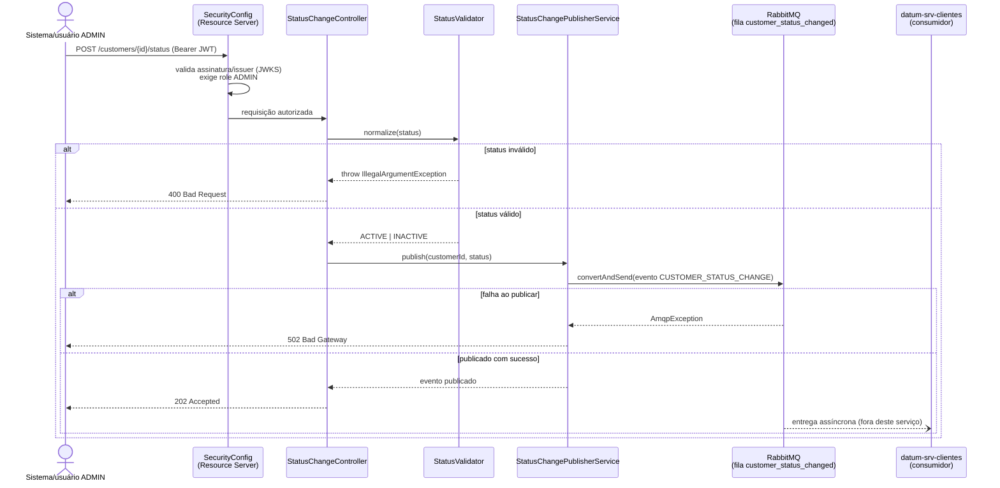
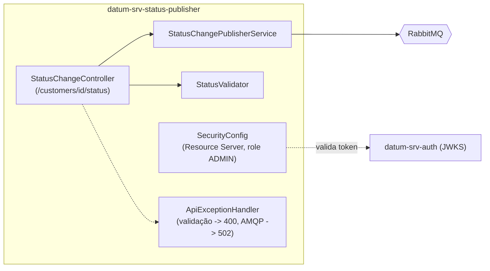

# datum-srv-status-publisher

Serviço publicador de solicitações de alteração de status de cliente, da stack **Datum**.

## Função do serviço

O `datum-srv-status-publisher` expõe um único endpoint (`POST /customers/{id}/status`) que recebe uma solicitação de mudança de status (`ACTIVE`/`INACTIVE`) e a **publica de forma assíncrona no RabbitMQ** — ele não altera diretamente nenhum dado de cliente; quem aplica a mudança é o `datum-srv-clientes`, do outro lado da fila.

- **Recebe e valida** a requisição (`status` obrigatório, normalizado para `ACTIVE`/`INACTIVE`, case-insensitive).
- **Publica o evento** `CUSTOMER_STATUS_CHANGE` diretamente na fila `customer_status_changed` (exchange padrão do RabbitMQ, roteamento pelo nome da fila).
- **Responde `202 Accepted`** com o evento publicado assim que a mensagem é aceita pelo broker — publicar *é* a própria operação: se falhar, a exceção é propagada e mapeada para `502 Bad Gateway` (diferente do publisher do `datum-srv-clientes`, que é best-effort, pois lá a criação do cliente já foi persistida antes).
- **Protege a operação por autorização**: como *OAuth2 Resource Server*, exige um Access Token JWT válido (emitido pelo `datum-srv-auth`) com papel `ADMIN`.

## Tecnologias

| Categoria | Tecnologia |
|---|---|
| Linguagem / runtime | Java 21 |
| Framework | Spring Boot 3.5.16 |
| Web | Spring Web (REST), Bean Validation (`spring-boot-starter-validation`) |
| Segurança | Spring Security, OAuth2 Resource Server (validação de JWT via JWKS) |
| Mensageria | Spring AMQP (RabbitMQ) — apenas publisher |
| Build | Maven (via `mvnw`) |
| Empacotamento / execução | Docker (build multi-stage `eclipse-temurin:21-jdk`) |
| Testes | Spring Boot Test, Spring Security Test |

Não usa banco de dados nem Spring Data/JPA — é stateless, sua única responsabilidade é validar a requisição e publicar a mensagem.

## Dependências (serviços necessários para funcionar)

| Dependência | Uso | Obrigatório |
|---|---|---|
| **RabbitMQ** | Publica o evento `CUSTOMER_STATUS_CHANGE` na fila `customer_status_changed` (declarada pela própria aplicação na subida, de forma idempotente — funciona independente de qual serviço sobe primeiro em relação ao `datum-srv-clientes`, que também a declara). | Sim — publicar é a própria operação do serviço; falha aqui retorna erro ao chamador. |
| **datum-srv-auth** | Valida o Access Token JWT (assinatura + claim `roles`) via JWKS, resolvido automaticamente a partir do `issuer-uri`. | Sim, para qualquer chamada |

Não depende diretamente do `datum-srv-clientes` nem do MariaDB — a relação com o `datum-srv-clientes` é apenas através da fila (contrato de mensagem compartilhado).

Variáveis de ambiente relevantes (ver `docker-compose.yml` na raiz do projeto): `RMQ_HOST`/`RMQ_PORT`/`RMQ_USERNAME`/`RMQ_PASSWORD`, `AUTH_HOST`/`AUTH_PORT` (issuer do JWT).

## Arquitetura

### Endpoint

| Método | Caminho | Papel exigido | Corpo | Resposta |
|---|---|---|---|---|
| `POST` | `/customers/{id}/status` | `ADMIN` | `{ "status": "ACTIVE" \| "INACTIVE" }` | `202 Accepted` com o evento publicado |

### Fluxo de publicação



### Componentes internos



- **Contrato de mensagem compartilhado**: o payload publicado (`eventId`, `eventType=CUSTOMER_STATUS_CHANGE`, `customerId`, `status`) segue exatamente o formato esperado pelo `CustomerStatusChangeListener` do `datum-srv-clientes` — os dois serviços não se conhecem em código, apenas concordam nesse contrato via fila.
- **Sem exchange dedicado**: a publicação usa o exchange padrão do RabbitMQ (`""`), com routing key igual ao nome da fila — roteamento direto, sem binding customizado.

## Como subir

Este serviço faz parte da stack orquestrada pelo `docker-compose.yml` na raiz do repositório [`projeto-datum`](https://github.com/alexmart001/projeto-datum). Para subir apenas ele (com suas dependências):

```bash
docker compose up rabbitmq datum-srv-auth datum-srv-status-publisher
```
